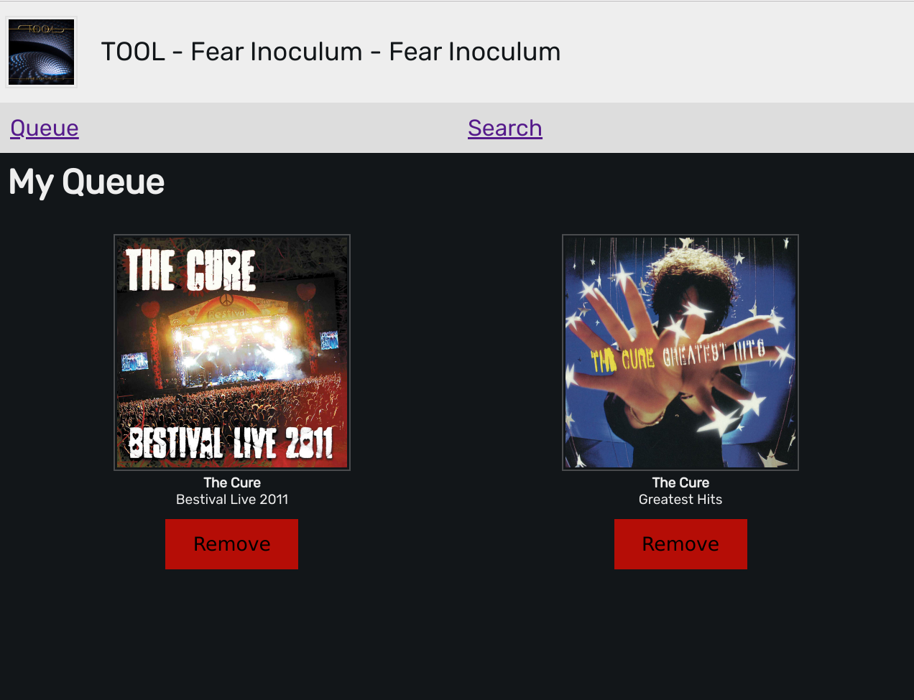
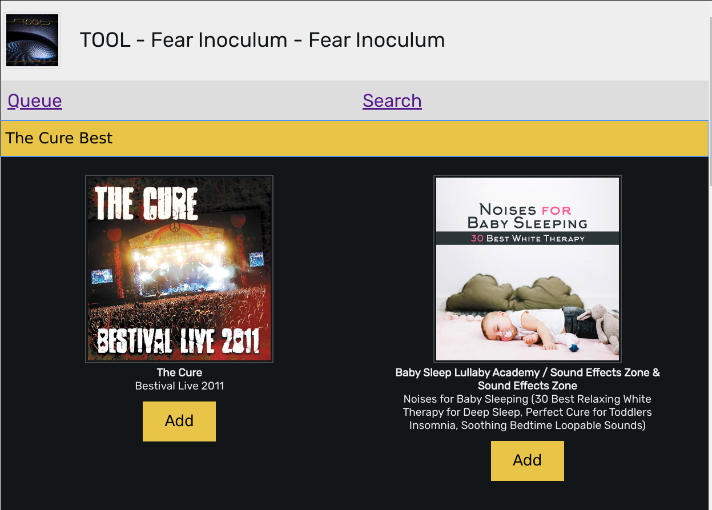

# The Queuer

A spotify frontend for a collaborative office listening experiance.

The Queuer allows individuals to create a custom album queue, the server will then round robin between all the users who have albums in their queues and play their albums.

## Setup.

Currently the application only runs on linux with spotify installed, It uses DBUS to connect to spotify and _should_ also work with spotifyd, although this is yet to be tested.

## Environment Vars

* `SPOTIFY_CLIENT_ID` client id from https://developer.spotify.com/dashboard
* `SPOTIFY_CLIENT_SECRET` client secret from https://developer.spotify.com/dashboard